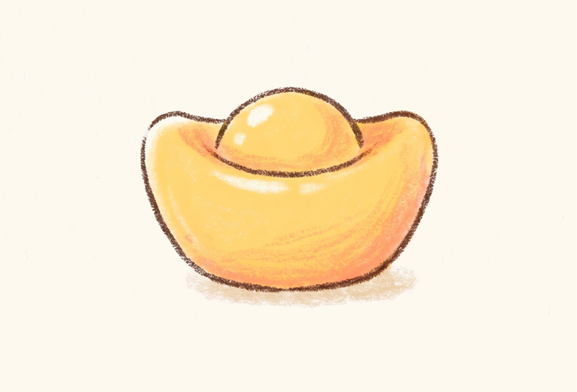
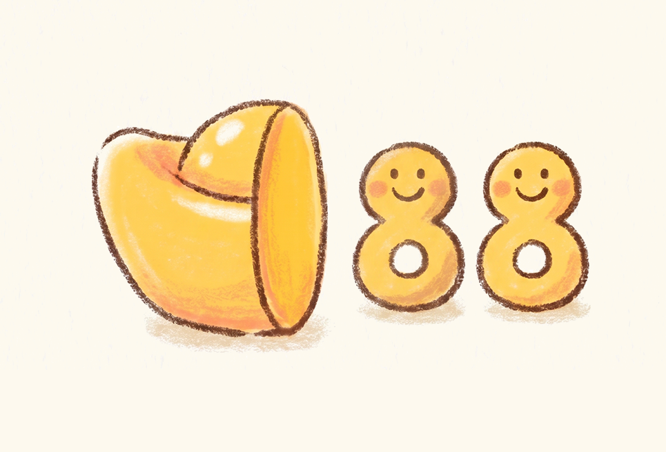

# CHARM-Bench

[](https://github.com/YuanNang/CHARM-Bench)
[](https://store.steampowered.com/app/4164310/_/)
[](https://huggingface.co/datasets/YuanNang/CHARM-Bench)
[](https://www.findthelamp.com/)
[](https://github.com/astral-sh/uv)
[](LICENSE)

**C**Hinese **H**omophonic **A**ssociative **R**easoning with **M**ultimodality Benchmark.

## Overview

CHARM is a multimodal benchmark inspired by a Chinese homophonic puzzle game. Each problem includes two images, a hint word, an answer category, and an answer length. Models can interact multiple times with the environment by submitting guesses. After each incorrect guess, the environment returns feedback on character positions and pinyin positions, which helps the model refine its next attempt.

We thank the game creators for the inspiration and the data source.

- Game store link: https://store.steampowered.com/app/4164310/_/
- Studio website: https://www.findthelamp.com/

If you need training data or commercial use permission, please contact the studio:
https://www.findthelamp.com/

## Example

### Puzzle Example: Chinese Homophonic Pun 中文谐音梗示例

Below is an example puzzle from CHARM demonstrating how the game works.

**Hint:** 这是金子 (This is gold / This is money)  
**Category:** 成语 (Idiom)  
**Answer Length:** 4 characters  
**Answer:** 半斤八两 (Half a catty and eight taels)

#### Images:

<div style="display: flex; gap: 30px; justify-content: center; align-items: center;">
  <div style="text-align: center;">
    <strong>Image 1</strong><br>
    
  </div>
  <div style="text-align: center;">
    <strong>Image 2</strong><br>
    
  </div>
</div>

#### Solution Explanation:

**Chinese 中文:**

第一张图显示"金子"（黄金/金币），提示词"金"与"斤"谐音。第二张图中，金元宝被切开为两部分，分别出现数字"8"，视觉上提示"半"（一半）和"两"（8的象征）。综合谐音推理，"金"→"斤"，配合图像中的"半"和"两个8"，可推断出成语答案"半斤八两"，意为能力或分量相当，不相上下。

**English:**

Image 1 shows gold coins or treasure, with the hint word "金" (gold) providing the homophonic clue. Image 2 depicts a gold ingot being split in two, with the number "8" appearing on each half, visually suggesting "半" (half) and "两" (two/eight). Through homophonic reasoning, "金" (gold/jin) sounds like "斤" (catty/jin), which combined with the visual cues of "half" and "two 8s" leads to the answer "半斤八两" (half a catty and eight taels). This idiom means two people or things are equally matched in ability or significance.

## License

- Code: MIT License (see LICENSE)
- Data: CC BY-NC 4.0 for non-commercial use only (see DATA_LICENSE.md)

## Benchmark Files

We provide benchmark manifests and image bundles:

- `data/charm-bench-100.jsonl` with images in `data/charm-bench-100.zip` (IDs 0-99)

Each manifest row contains:

- `id`: the benchmark ID (0..N-1)
- `answer`, `ref_word`, `category`, `answer_length`, `pinyin_syllables`
- `image_1`, `image_2`: repo-relative image paths

## Install

This project uses [uv](https://github.com/astral-sh/uv), an extremely fast Python package manager and installer. Follow the steps below to set up your environment and prepare the benchmark data.

### 1. Install `uv` (if you haven't already)

Choose the command based on your Operating System:

```bash
# macOS / Linux
curl -LsSf https://astral.sh/uv/install.sh | sh

# Windows (PowerShell)
powershell -ExecutionPolicy ByPass -c "irm https://astral.sh/uv/install.ps1 | iex"

# Alternatively, via pip
pip install uv

```

### 2. Sync Environment

Once `uv` is installed, run the following command in the project root to automatically create a virtual environment and install all required dependencies:

```bash
uv sync

```

### 3. Download Data

You can download the benchmark data (manifest and image bundles) either from Hugging Face or directly from this repository using Git LFS.

#### Method A: From Hugging Face (Recommended)

The dataset is hosted on Hugging Face: [YuanNang/CHARM-Bench](https://www.google.com/url?sa=E&source=gmail&q=https://huggingface.co/datasets/YuanNang/CHARM-Bench).

```bash
uvx --from huggingface_hub hf download YuanNang/CHARM-Bench --local-dir data --repo-type dataset

```

#### Method B: From GitHub (Git LFS)

Alternatively, the files are stored within this GitHub repository using Git LFS.

1. Make sure **Git LFS** is installed on your operating system (e.g., `brew install git-lfs` on macOS, or `sudo apt-get install git-lfs` on Ubuntu).
2. If you already cloned the repository but the `.zip` files are just small 1 KB text pointers, run the following commands to pull the actual binary data:

```bash
git lfs install
git lfs pull

```

### 4. Unpack Images

Unzip the images into the data directory so the paths in the manifest resolve correctly:

```bash
# 100-image pack
unzip data/charm-bench-100.zip -d data/benchmark

```

## Run Evaluation

Run an evaluation:

```bash
uv run charm eval \
  --manifest data/charm-bench-100.jsonl \
  --provider openai \
  --model gpt-4.1 \
  --max-attempts 1

```

Notes:

* If you omit `--out`, the default path is `runs/<normalized-model>/run.jsonl`.
* If you omit `--manifest`, the default path is `data/charm-bench-100.jsonl`.
* You can resume from checkpoints automatically by re-running the same command.
* `--max-attempts` controls the max guesses per problem (use unlimited/inf/none for no limit).
* `--concurrency` controls how many problems run in parallel.
* `--limit` truncates the manifest to the first N problems.

Provider credentials are read from `.env`:

```bash
CHARM_API_KEY=your_api_key_here
CHARM_BASE_URL=your_base_url_here
CHARM_PROVIDER=openai
CHARM_MANIFEST=data/charm-bench-100.jsonl
CHARM_MAX_ATTEMPTS=1
CHARM_CONCURRENCY=2
CHARM_TIMEOUT=600
CHARM_MODEL=your_model_name_here
CHARM_MAX_TOKENS=32768

```

## Environment Feedback

After an incorrect guess, the environment returns two feedback streams:

* **Character feedback**: green = correct position, yellow = wrong position, gray = not present.
* **Pinyin feedback**: the same rules applied to tone-less pinyin syllables.

If the submitted answer length does not match the expected length, the environment returns a `length_mismatch` error and skips character and pinyin feedback for that guess.

## Evaluation Results

Here are the baseline results evaluated on `charm-bench-100.jsonl`:

| Model | Provider | Max Attempts | Score (out of 100) |
| --- | --- | --- | --- |
| gemini-3.5-flash | google | 1 | 72 |
| SenseNova-6.7-Flash-Lite | openai | 1 | 33 |
| LongCat-2.0-Preview | openai | 1 | 10 |

*We welcome contributions to update this table with results from other models!*

## Contributing

The current benchmark is relatively easy; we welcome high-difficulty problems to enrich it. Planned roadmap items include difficulty tiers, category breakdowns, and a public model leaderboard.

If you find this useful, please consider starring the repo and contributing challenging new problems.
